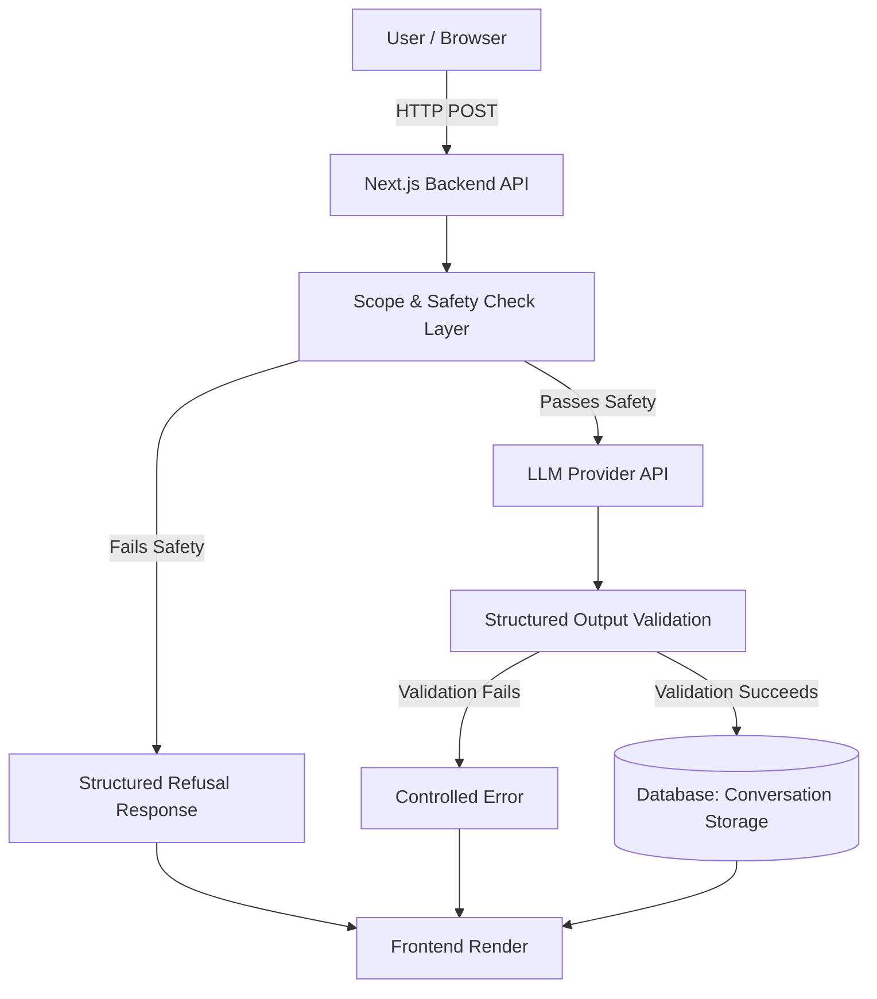

# AI Nutrition Assistant — Architecture Document

This document outlines the high-level architecture, technology stack, data schemas, and key flows for the AI Nutrition Assistant (Milestone 1). The design prioritizes modularity, safety, and readiness for a retrieval-augmented generation (RAG) system in Milestone 2.

## 1. System Architecture

The application follows a client-server model, utilizing Next.js as the full-stack framework. All AI model interactions and safety validations are securely executed on the backend.



### Key Architectural Constraints
- **Security:** Model API keys must never be exposed to the client. All model calls happen server-side.
- **Future-proofing:** The frontend API contract and data schemas must remain stable for Milestone 2 (when evidence retrieval will populate `source` fields).
- **Graceful Failure:** Any failure in safety checks, API communication, or schema validation must yield a controlled, structured fallback response.

## 2. Technology Stack

- **Frontend:** Next.js, React, TypeScript.
- **Backend:** Next.js API Routes / Server Actions (Node.js edge/serverless).
- **LLM Provider:** Groq API
- **Validation:** Zod (or native structured output capabilities provided by the LLM SDK).
- **Database:** SQLite (local/prototype) or Supabase/PostgreSQL (production).
- **Deployment:** Vercel.

## 3. Data Schemas

### 3.1 LLM Response Contract
The application enforces a strict schema for the assistant's replies. Responses must be consistently formatted as JSON objects.

```typescript
type Claim = {
  claim: string;
  source: string | null; // Always null in Milestone 1. Populated in Milestone 2.
};

type AssistantResponse = {
  answer: string;
  claims: Claim[];
};
```

### 3.2 Database Models
To preserve conversational context, messages and conversations are stored in a relational structure.

**Table: `Conversation`**
| Field | Type | Description |
| :--- | :--- | :--- |
| `id` | UUID/String | Primary key |
| `created_at` | Timestamp | Conversation start time |
| `updated_at` | Timestamp | Last message time |

**Table: `Message`**
| Field | Type | Description |
| :--- | :--- | :--- |
| `id` | UUID/String | Primary key |
| `conversation_id` | UUID/String | Foreign key -> Conversation.id |
| `role` | String | `'user'` \| `'assistant'` |
| `content` | String | Raw text for user, or stringified `answer` for assistant |
| `structured_response`| JSON | Optional. Stores the full `AssistantResponse` payload |
| `created_at` | Timestamp | Message send time |

## 4. API Endpoints

### `POST /api/chat`
Handles incoming user messages and returns the assistant's structured response.

**Request Body:**
```json
{
  "conversationId": "optional-uuid",
  "message": "What foods are good sources of protein?"
}
```

**Response Body (Success):**
```json
{
  "conversationId": "123e4567-e89b-12d3-a456-426614174000",
  "response": {
    "answer": "Several plant foods can contribute meaningful amounts of protein, including legumes, tofu and tempeh.",
    "claims": [
      {
        "claim": "Legumes provide dietary protein.",
        "source": null
      }
    ]
  }
}
```

## 5. Core Application Flows

### 5.1 Scope and Safety Layer
Before invoking the LLM, the backend applies a filtering layer. If the user asks for:
- Calorie targets
- Weight targets
- Individualized medical/dietary advice
The safety layer short-circuits the LLM call and immediately returns a predefined structured refusal. 

### 5.2 Structured Output Enforcement
The backend enforces that the LLM adheres strictly to the `AssistantResponse` schema.
1. Use provider-level structured output flags (e.g., OpenAI's `response_format` with `json_schema`).
2. Parse the output via Zod to guarantee runtime type safety before writing to the database or responding to the client.
3. Reject arbitrary prose; do not attempt regex or loose parsing.

### 5.3 Error Handling Strategy
The system must never expose stack traces or raw API errors to the user.
- **Empty Messages:** Return `400 Bad Request`.
- **Validation/Parse Failure:** Return `500 Internal Server Error` with a generic fallback message.
- **LLM Timeout/Rate Limit:** Return `503 Service Unavailable`.

## 6. Milestone 2 Readiness (RAG Preparation)
- The user interface implements a "Sources" panel that currently renders an empty state (`"Sources will appear here when evidence retrieval is enabled."`).
- The `Claim` object structure is finalized to accept source identifiers (URLs/citation strings) from a future vector DB / search service without needing frontend schema updates.
